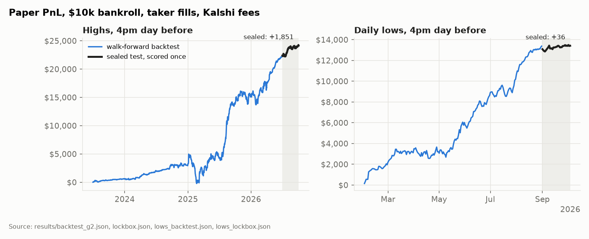

# isotherm

[[Dashboard]](https://physicalreasoning.ai/isotherm/)
[[Blog]](https://physicalreasoning.ai/blog/the-weather-market-learned-to-read-the-forecast/)
[[Findings]](FINDINGS.md)
[[Model card]](docs/MODEL_CARD.md)
[[Evaluation protocol]](docs/EVALS.md)
[[DOI]](https://doi.org/10.5281/zenodo.23167633)

isotherm is a calibrated decision model for prediction markets. Given a market state, it returns one
probability distribution over the outcome and answers typed questions from it. We evaluate it on
Kalshi's daily temperature markets against the market's own price, walk-forward, with sealed
out-of-sample tests scored once under pre-registered rules [16].



> **Figure 1.** Paper PnL of the frozen strategies under nested walk-forward selection, then the sealed
> test scored once (shaded). Left: daily highs. Right: daily lows.

## Approach

For each bucket of a Kalshi ladder, the model combines the market price, EMOS-calibrated NWS
forecasts [2, 4, 13] and climatology in a learned logarithmic opinion pool [5], adds a small MLP
correction, and normalises over the ladder. It is trained on the log score [3] with recency
weighting, starts out equal to the market, and averages five seeds [15]. Every typed answer (Choice,
Noul, Score, after TypeSafe's Jev) is read off the same distribution, so answers cannot contradict
one another.

Evaluation is walk-forward by quarter with a two-day embargo and identical rows for every model,
scored with proper scoring rules [1, 3, 12] against the market at the same timestamp and compared
with Diebold-Mariano tests [9]. Backtests model Kalshi's fees, taker fills capped by later volume and
maker fills on trade-throughs only [17], size with fractional Kelly over the whole ladder [6], select
configurations by nested walk-forward, and report deflated Sharpe [7] and the probability of
backtest overfitting [8].

## Results

Out of sample on 24,344 ladders across seven cities and four read times. Gains are in nats per
ladder over the market; intervals are 95% date-block bootstraps [14].

| Test | Result |
|---|---|
| Probabilistic skill, all periods | +0.035 to +0.070 at every read time |
| Probabilistic skill, last 12 months | +0.009 to +0.017; best at 14:00, +0.017 [+0.010, +0.025] |
| Calibration error [11] | 0.003 to 0.005, against the market's 0.013 to 0.020 |
| Leakage control | network trained on market-sampled labels: within ±0.002 of the market |
| Backtest, 16:00 day-before taker | Sharpe 2.06 [0.82, 3.30], deflated Sharpe 0.865, PBO 0.24 |
| Sealed test, highs (Jul to Oct 2026) | +$1,851, Newey-West *t* 1.77 [10]; monthly $1,029, $517, $246 |
| Sealed test, lows (Sep to Oct 2026) | +$36 after a backtest with deflated Sharpe 0.98 |
| MLB game winners | no edge, within ±0.001 of the market |
| Transformer over buckets | within 0.004 of the MLP; fails its pre-registered gate, not adopted |

The edge was large in 2023 and has mostly decayed: the market now prices the National Blend of
Models but still underweights GFS MOS. Every result, correction and negative finding is in
[FINDINGS.md](FINDINGS.md).

## Setup

Python 3.11+ and [uv](https://docs.astral.sh/uv/):

    uv sync

Data comes from unauthenticated public endpoints (Kalshi market data, Iowa Environmental Mesonet)
and is cached locally; nothing is redistributed. An optional Kalshi API key raises the rate limit.

## Usage

Rebuild the data and every result:

```bash
uv run scripts/fetch_forecasts.py && uv run scripts/build_weather_panel.py
uv run scripts/check_labels.py
uv run scripts/benchmark.py --suite g2
uv run scripts/fetch_trades.py && uv run scripts/backtest.py --suite g2
uv run scripts/report.py && uv run scripts/plots.py && uv run scripts/dashboard.py
```

Ask the frozen model a question about tomorrow's ladder:

```bash
uv run uvicorn isotherm.serve:app
curl -s -X POST localhost:8000/decide -H 'content-type: application/json' \
  -d '{"city": "NY", "questions": [{"kind": "noul", "set": {"lo": 70}}]}'
```

The sealed tests have already been scored and should not be re-scored with new configurations.

## Live record

The strategy that passed its sealed test is scored in shadow every day at 16:00 local, and its paper
trades are committed to the [`shadow-ledger`](../../tree/shadow-ledger) branch before the outcome
exists. A rolling decay alarm flags when the edge is gone. Nothing here is investment advice.

## Citation

Use **Cite this repository** in the sidebar ([CITATION.cff](CITATION.cff)), or cite the archived
release: [10.5281/zenodo.23167633](https://doi.org/10.5281/zenodo.23167633). The typed-question design
follows TypeSafe AI's Jev (2026); isotherm is independent and not affiliated with TypeSafe. Data:
Kalshi public market data; Iowa Environmental Mesonet, Iowa State University.

<details>
<summary>References</summary>

1. G. W. Brier. Verification of forecasts expressed in terms of probability. *Monthly Weather Review*, 78(1):1–3, 1950.
2. T. Gneiting, A. E. Raftery, A. H. Westveld III, T. Goldman. Calibrated probabilistic forecasting using ensemble model output statistics and minimum CRPS estimation. *Monthly Weather Review*, 133(5):1098–1118, 2005.
3. T. Gneiting, A. E. Raftery. Strictly proper scoring rules, prediction, and estimation. *Journal of the American Statistical Association*, 102(477):359–378, 2007.
4. H. R. Glahn, D. A. Lowry. The use of model output statistics (MOS) in objective weather forecasting. *Journal of Applied Meteorology*, 11(8):1203–1211, 1972.
5. C. Genest, J. V. Zidek. Combining probability distributions: a critique and an annotated bibliography. *Statistical Science*, 1(1):114–135, 1986.
6. J. L. Kelly. A new interpretation of information rate. *Bell System Technical Journal*, 35(4):917–926, 1956.
7. D. H. Bailey, M. López de Prado. The deflated Sharpe ratio: correcting for selection bias, backtest overfitting, and non-normality. *Journal of Portfolio Management*, 40(5):94–107, 2014.
8. D. H. Bailey, J. M. Borwein, M. López de Prado, Q. J. Zhu. The probability of backtest overfitting. *Journal of Computational Finance*, 20(4):39–69, 2017.
9. F. X. Diebold, R. S. Mariano. Comparing predictive accuracy. *Journal of Business & Economic Statistics*, 13(3):253–263, 1995.
10. W. K. Newey, K. D. West. A simple, positive semi-definite, heteroskedasticity and autocorrelation consistent covariance matrix. *Econometrica*, 55(3):703–708, 1987.
11. A. Kumar, P. Liang, T. Ma. Verified uncertainty calibration. *Advances in Neural Information Processing Systems 32*, 2019.
12. E. S. Epstein. A scoring system for probability forecasts of ranked categories. *Journal of Applied Meteorology*, 8(6):985–987, 1969.
13. J. P. Craven, D. E. Rudack, P. E. Shafer. National Blend of Models: a statistically post-processed multi-model ensemble. *Journal of Operational Meteorology*, 8(1):1–14, 2020.
14. D. N. Politis, J. P. Romano. The stationary bootstrap. *Journal of the American Statistical Association*, 89(428):1303–1313, 1994.
15. B. Lakshminarayanan, A. Pritzel, C. Blundell. Simple and scalable predictive uncertainty estimation using deep ensembles. *Advances in Neural Information Processing Systems 30*, 2017.
16. B. A. Nosek, C. R. Ebersole, A. C. DeHaven, D. T. Mellor. The preregistration revolution. *Proceedings of the National Academy of Sciences*, 115(11):2600–2606, 2018.
17. L. R. Glosten, P. R. Milgrom. Bid, ask and transaction prices in a specialist market with heterogeneously informed traders. *Journal of Financial Economics*, 14(1):71–100, 1985.

</details>

## License

Apache-2.0.
