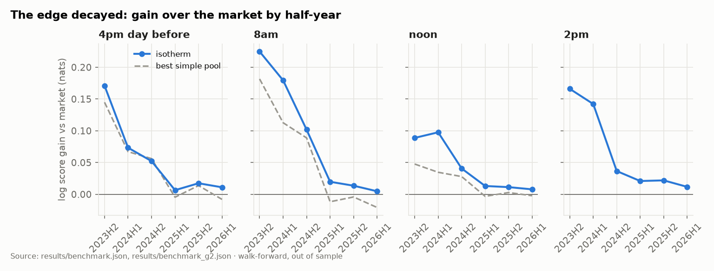
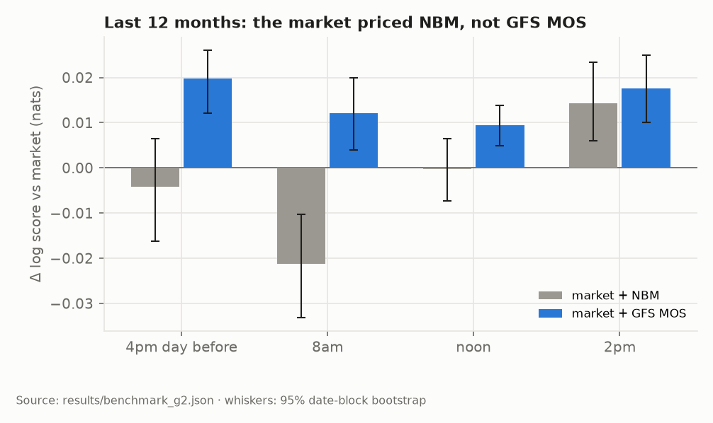
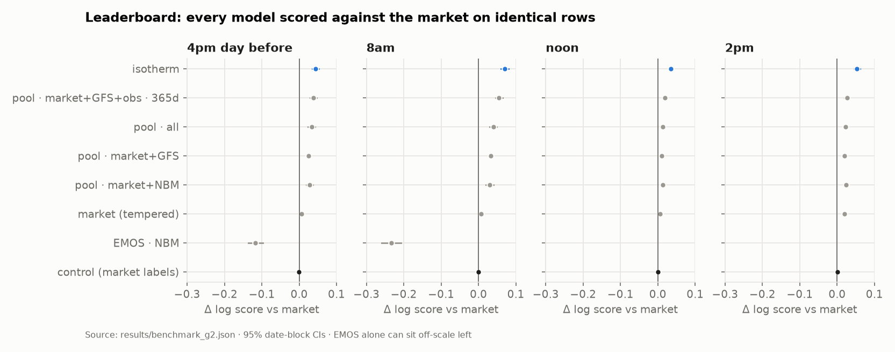
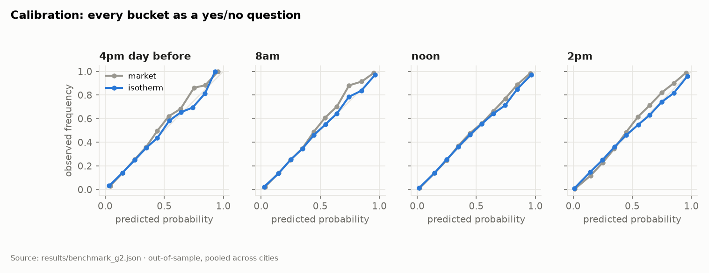
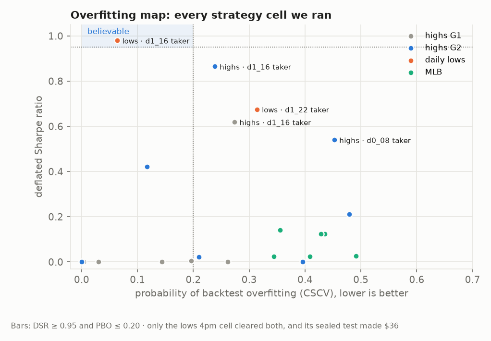
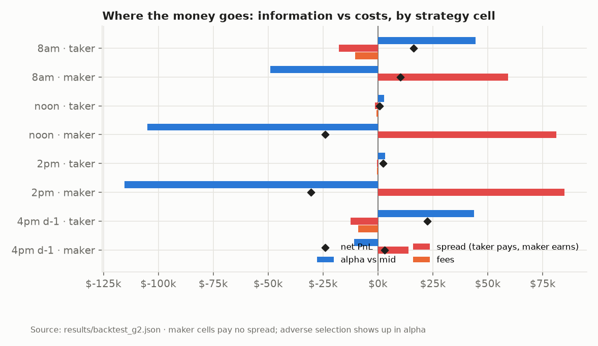
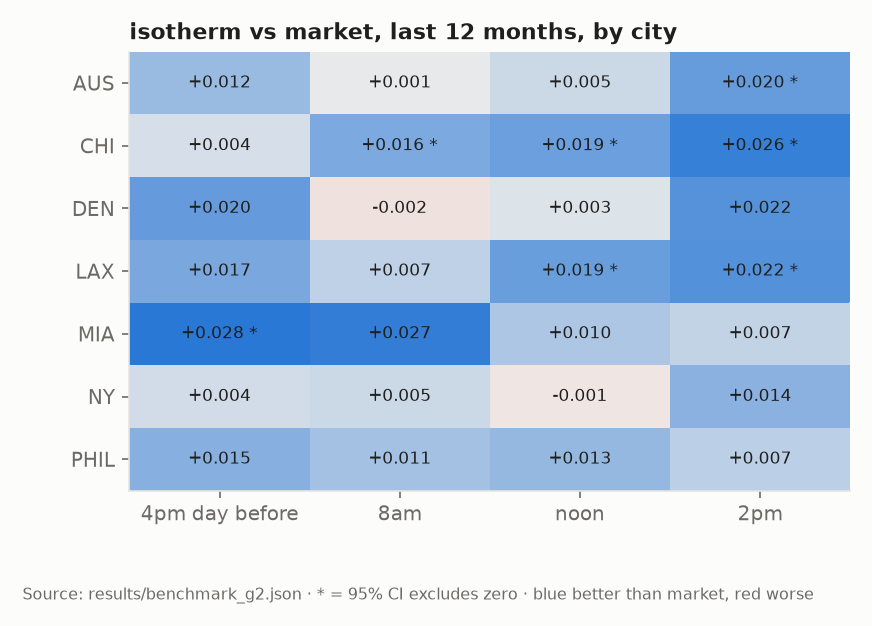
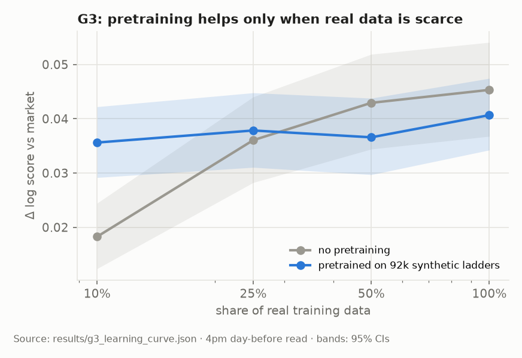

<h1 align="center">isotherm</h1>

<p align="center">
  <b>Calibrated decision models for prediction markets, evaluated against the market</b>
</p>

<p align="center">
  <a href="https://github.com/physicalreasoning/isotherm/actions/workflows/tests.yml"></a>
  <a href="https://physicalreasoning.github.io/isotherm/"></a>
  <a href="LICENSE"></a>
  
</p>

<p align="center">
  <a href="https://physicalreasoning.github.io/isotherm/"><b>Dashboard</b></a> ·
  <a href="https://physicalreasoning.ai/blog/the-weather-market-learned-to-read-the-forecast/">Blog post</a> ·
  <a href="FINDINGS.md">Findings</a> ·
  <a href="docs/MODEL_CARD.md">Model card</a> ·
  <a href="docs/EVALS.md">Evaluation protocol</a>
</p>

---

## Abstract

We study whether free public weather forecasts carry information that Kalshi's daily temperature
markets fail to price, and whether that information survives the cost of trading on it. Following
the typed decision-model design of TypeSafe's Jev, isotherm maps a market state to one calibrated
distribution over the settled temperature and answers every question from it. On 24,344
out-of-sample ladders across seven cities and four read times, scored walk-forward against the
market's own price with proper scoring rules [1, 3], the model beats the market at every read time and is better
calibrated than it. The edge decays sharply: forecasts that beat the market by 0.18 nats per ladder
in 2023 add almost nothing by 2025, and the market now prices the public National Blend of Models
[13] while still underweighting GFS MOS [4]. A cost-aware strategy passes a pre-registered sealed
test, marginally, with profits halving month on month; the same pipeline finds no edge in MLB and an
edge in daily lows that disappears out of sample.

<p align="center">
  
</p>
<p align="center"><sub><b>Figure 1.</b> Paper PnL of the frozen strategies under nested walk-forward selection, followed by
the sealed test scored once (shaded). Left: daily highs. Right: daily lows.</sub></p>

## Main results

All numbers are out of sample. Gains are log score improvements over the market's implied
distribution at the same timestamp, in nats per ladder, with 95% date-block bootstrap intervals.

| | Result |
|---|---|
| **Probabilistic skill**, all periods | +0.035 to +0.070 across four read times; calibration error 0.003 to 0.005 vs the market's 0.013 to 0.020 |
| **Probabilistic skill**, last 12 months | +0.009 to +0.017; best at 14:00 local, +0.017 [+0.010, +0.025] |
| **Leakage control** | the same network trained on labels sampled from the market scores within ±0.002 of it |
| **Backtest**, 16:00 day-before taker | +$22,311 on a $10k bankroll, Sharpe 2.06 [0.82, 3.30], deflated Sharpe 0.865 [7], PBO 0.24 [8] |
| **Sealed test**, highs, Jul to Oct 2026 | +$1,851, Newey-West *t* 1.77 [10]: pass by the pre-registered rule; monthly PnL $1,029, $517, $246 |
| **Sealed test**, daily lows, Sep to Oct 2026 | +$36 (*t* 0.06) after a backtest with deflated Sharpe 0.98 and PBO 0.06 |
| **MLB game winners** | no edge: within ±0.001 nats of the market at every read |
| **Synthetic pretraining** | +0.017 with 10% of real data, −0.005 with all of it; not adopted |

The full record, including the bugs that were caught, the gate that was amended and every
negative result, is in [FINDINGS.md](FINDINGS.md).

## Method

**Data.** Kalshi's public market data (ladders, hourly candles, 17M trades) and the Iowa
Environmental Mesonet's archives of NWS products: GFS MOS [4], the National Blend of Models [13],
daily climate reports and METAR observations. Every input is restricted to what was public at the
read time; labels are Kalshi's own settlement.

**Model.** For each bucket of a ladder, a learned logarithmic opinion pool [5] of the market, EMOS
forecasts [2] and climatology, plus an MLP correction over bucket and context features, normalised
by a softmax over the ladder. Trained on the log score with recency weighting, initialised to equal
the market, averaged over five seeds [15]. Typed answers (Choice, Noul, Score) are read off one
distribution, so they cannot contradict one another.

**Evaluation.** Walk-forward by quarter with a two-day embargo, identical rows for every model, and
a sealed lockbox scored once under pre-registered criteria [16]. Proper scoring rules (log score,
ranked probability score [12], Brier [1]) and debiased calibration error [11]. Model comparisons use
date-block bootstraps and Diebold-Mariano tests [9]. Backtests model Kalshi's fee schedule, taker
fills capped by subsequent volume and maker fills on trade-throughs only, size with fractional
Kelly over the whole ladder [6], select configurations by nested walk-forward and report deflated
Sharpe [7], PBO [8], stationary-bootstrap intervals [14] and engine placebos. Adverse selection in
maker fills follows Glosten and Milgrom [17].

## Reproduce

```bash
uv sync
uv run scripts/survey_markets.py               # market selection
uv run scripts/fetch_forecasts.py              # NWS archives from IEM
uv run scripts/build_weather_panel.py          # point-in-time Kalshi ladders
uv run scripts/check_labels.py                 # label validation
uv run scripts/benchmark.py --suite g2         # probabilistic evaluation
uv run scripts/fetch_trades.py                 # trade tape for maker fills
uv run scripts/backtest.py --suite g2          # cost-aware backtests
uv run scripts/report.py && uv run scripts/plots.py && uv run scripts/dashboard.py
uv run pytest
```

Only unauthenticated public endpoints are required; an optional Kalshi API key raises the rate
limit. Raw data is not redistributed. The lockboxes have already been scored and should not be
re-scored with new configurations.

<details>
<summary><b>Repository layout</b></summary>

```
src/isotherm/   data clients, point-in-time panels, EMOS, model, baselines, splits,
                metrics, backtest engine, statistics, live scoring, HTTP service
scripts/        one experiment per file, each writing results/<name>.json
results/        raw results, SUMMARY.md, figures in plots/
docs/           plan, evaluation protocol, model card, market notes
tests/          label arithmetic, leakage invariants, scoring, accounting
```
</details>

<details>
<summary><b>More figures</b></summary>

| | |
|---|---|
|  |  |
|  |  |
|  |  |
|  |  |
</details>

## Live record and serving

The strategy that passed the sealed test runs in shadow mode: every day at 16:00 local a
scheduled job scores the next day's ladders and commits its paper trades to the
[`shadow-ledger`](../../tree/shadow-ledger) branch before the outcome exists, with a rolling
decay alarm. The model is served with `uv run uvicorn isotherm.serve:app`; see the
[model card](docs/MODEL_CARD.md) for intended use and limits. Nothing here is investment advice.

## Citation

```bibtex
@software{isotherm2026,
  title  = {isotherm: Calibrated decision models for prediction markets},
  author = {{Physical Reasoning}},
  year   = {2026},
  url    = {https://github.com/physicalreasoning/isotherm}
}
```

## References

1. G. W. Brier. Verification of forecasts expressed in terms of probability. *Monthly Weather Review*, 78(1):1–3, 1950.
2. T. Gneiting, A. E. Raftery, A. H. Westveld III, T. Goldman. Calibrated probabilistic forecasting using ensemble model output statistics and minimum CRPS estimation. *Monthly Weather Review*, 133(5):1098–1118, 2005.
3. T. Gneiting, A. E. Raftery. Strictly proper scoring rules, prediction, and estimation. *Journal of the American Statistical Association*, 102(477):359–378, 2007.
4. H. R. Glahn, D. A. Lowry. The use of model output statistics (MOS) in objective weather forecasting. *Journal of Applied Meteorology*, 11(8):1203–1211, 1972.
5. C. Genest, J. V. Zidek. Combining probability distributions: a critique and an annotated bibliography. *Statistical Science*, 1(1):114–135, 1986.
6. J. L. Kelly. A new interpretation of information rate. *Bell System Technical Journal*, 35(4):917–926, 1956.
7. D. H. Bailey, M. López de Prado. The deflated Sharpe ratio: correcting for selection bias, backtest overfitting, and non-normality. *Journal of Portfolio Management*, 40(5):94–107, 2014.
8. D. H. Bailey, J. M. Borwein, M. López de Prado, Q. J. Zhu. The probability of backtest overfitting. *Journal of Computational Finance*, 20(4):39–69, 2017.
9. F. X. Diebold, R. S. Mariano. Comparing predictive accuracy. *Journal of Business & Economic Statistics*, 13(3):253–263, 1995.
10. W. K. Newey, K. D. West. A simple, positive semi-definite, heteroskedasticity and autocorrelation consistent covariance matrix. *Econometrica*, 55(3):703–708, 1987.
11. A. Kumar, P. Liang, T. Ma. Verified uncertainty calibration. *Advances in Neural Information Processing Systems 32*, 2019.
12. E. S. Epstein. A scoring system for probability forecasts of ranked categories. *Journal of Applied Meteorology*, 8(6):985–987, 1969.
13. J. P. Craven, D. E. Rudack, P. E. Shafer. National Blend of Models: a statistically post-processed multi-model ensemble. *Journal of Operational Meteorology*, 8(1):1–14, 2020.
14. D. N. Politis, J. P. Romano. The stationary bootstrap. *Journal of the American Statistical Association*, 89(428):1303–1313, 1994.
15. B. Lakshminarayanan, A. Pritzel, C. Blundell. Simple and scalable predictive uncertainty estimation using deep ensembles. *Advances in Neural Information Processing Systems 30*, 2017.
16. B. A. Nosek, C. R. Ebersole, A. C. DeHaven, D. T. Mellor. The preregistration revolution. *Proceedings of the National Academy of Sciences*, 115(11):2600–2606, 2018.
17. L. R. Glosten, P. R. Milgrom. Bid, ask and transaction prices in a specialist market with heterogeneously informed traders. *Journal of Financial Economics*, 14(1):71–100, 1985.

The typed question design (Choice, Noul, Score) follows TypeSafe AI's Jev (2026); isotherm is an
independent open implementation and is not affiliated with TypeSafe. Data: Kalshi public market
data API; Iowa Environmental Mesonet, Iowa State University.

## License

Apache-2.0.
